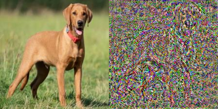
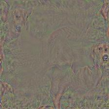

# Metamer Finder

Metamer Finder is a specialized PyTorch research tool designed to generate neural metamers—physically distinct inputs that elicit nearly identical internal representations within a deep neural network.

By optimizing an input image (starting from noise or another image) to minimize the distance between its activations and a target image's activations, we can "see" what information is preserved at different stages of the neural hierarchy.

---

## Features

- **Dual-Interface System**:
  - **CLI**: High-throughput metamer generation for large-scale experiments.
  - **Interactive GUI**: A PyQt6-based application for real-time visualization, dynamic model switching, and selective pixel masking.
- **Advanced Optimization Strategies**:
  - **Exact Spatial (MSE)**: Matches the precise spatial activations of the target.
  - **Texture/Style (Gram Matrix)**: Matches the global statistics/texture of the target while discarding spatial constraints.
  - **Total Variation (TV) Smoothing**: Penalizes high-frequency noise for more "natural" looking visualizations.
- **Data-Agnostic Engine**: Optimized for vision models but compatible with any PyTorch nn.Module and raw continuous tensors of any dimension (e.g., audio, images, 1D time-series).
- **Architectural Awareness**: Automated analysis of residual skip connections to identify robust optimization targets.
- **Selective Optimization**: Interactive drawing canvas with Brush and Rectangle tools to "freeze" specific image regions during generation.
- **Live Visual Feedback**: Watch the metamer evolve in real-time as the optimizer matches the target activations.

---

## Safe Choke Points

When working with modern architectures like ResNet, not all layers are equal. Metamer Finder includes a specialized inspection tool (inspect_model.py) that uses torch.fx symbolic tracing to identify Residual Skip Connections:

- **Inside Residual**: Layers within a residual block only contribute a delta to the main identity path. Targeting these can lead to unstable optimization as the network can "bypass" your changes via the skip connection.
- **Safe Choke Point**: These are layers where the entire signal must pass through a single module (e.g., the output of a residual block). Targeting these ensures that your generated metamer truly captures the full state of the network at that depth.

---

## Example Results

Below is a metamer generated using VGG16 matching features.25 layer using MSE.

  
*Left: Original Target Image | Right: Generated Metamer (Neural Noise)*

VGG 16 matching featues.30 using MSE and TV=0.001  


VGG 16 matching featues.20 using Gram Matrix  


---

## Installation

You can install Metamer Finder in two ways depending on how you plan to use it:

### 1. Quick Install (Best for most users)
Install the latest version directly from GitHub to get the global commands immediately.
```bash
pip install git+https://github.com/BraydenKO/MetamerFinder.git
```

### 2. Local Clone (Best for tweaking or research)
Clone the repository if you want to explore the code or run the included experiments. Installing with `-e` (editable mode) means any changes you make to the code are reflected immediately in your commands.
```bash
git clone https://github.com/BraydenKO/MetamerFinder.git
cd MetamerFinder
pip install -e .
```

---

## Usage

Metamer Finder provides three ways to work: global terminal commands, direct python scripts, or as a library in your own code.

### 1. Interactive GUI
```bash
# Global command (available after pip install)
metamer-gui

# Or run the script directly from the repo
python gui_app.py
```

### 2. Command Line Interface
```bash
# Global command
metamer-finder -i inputs/dog.png -l features.15 --iters 500

# Or run the script directly
python main.py --image inputs/dog.png --layers features.15
```

### 3. Model Inspection
Analyze model architecture to find safe layers for optimization.
```bash
# Global command
metamer-inspect -m resnet50 --types

# Or run the script directly
python inspect_model.py --model resnet50 --types
```

### 4. Integration as a Python Library
You can import the core engine directly into your research pipelines:

```python
import torch
from metamer_finder import FeatureExtractor, MetamerOptimizer, load_model, analyze_skip_connections

# 1. Load model and analyze skip connections
model = load_model("vgg16", torch.device("cpu"))
skip_info = analyze_skip_connections(model)

# 2. Extract and Optimize
extractor = FeatureExtractor(model, ["features.15"])
optimizer = MetamerOptimizer(extractor, target_features)
metamer = optimizer.generate(starting_image=noise_tensor)
```

---

## Inspiration & References

This tool is heavily inspired by the work of Jenelle Feather and the McDermott Lab at MIT, whose research utilizes model metamers as a primary tool to probe the divergence between human perceptual systems and artificial neural networks.

- **Metamers of neural networks reveal divergence from human perceptual systems (Feather et al., NeurIPS 2019)**: This seminal work established the core methodology of using gradient descent to match intermediate CNN representations, demonstrating that deeper layers produce metamers that are indistinguishable to the model yet completely unrecognizable to human observers.
- **Model metamers reveal divergent invariances between biological and artificial neural networks (Feather et al., Nature Neuroscience 2023)**: This paper expanded the scope to a wide range of architectures (including Transformers and robustly trained models), quantifying how artificial invariances—such as a bias toward local texture—diverge significantly from primate visual processing.

---

## Project Structure

- `metamer_finder/`: Core package containing extraction, optimization, and GUI logic.
- `experiments/`: Research notebooks and specialized model adaptations (e.g., Transformers, Neural Decoders).
- `inputs/`: Directory for target images and tensors.
- `results/`: Default output directory for generated metamers and comparisons.
- `examples/`: Permanent assets for documentation.
- `gui_app.py`: Entry point for the graphical application.
- `main.py`: Entry point for the CLI.
- `inspect_model.py`: Structural analysis utility.

---

## Experiments & Demos

The `experiments/` directory contains Jupyter notebooks and datasets demonstrating the tool's versatility across different domains:

- **Neural Decoding (MC_Maze)**: Using the `NeuralDataTransformer` (NDT) to generate metamers for biological neural activity. This experiment probes what features of motor cortical spiking patterns are essential for a decoder to reconstruct movement.
- **Natural Language Processing**: Investigating how language models represent text by generating metamers in the continuous embedding space, revealing the model's sensitivity to semantic vs. syntactic shifts.
- **Multimodal Models (CLIP & BLIP)**: Generating "cross-modal metamers" that bridge vision and language. This includes using CLIP to generate images that match specific text embeddings, and using BLIP to explore generative vision-to-language mappings.
